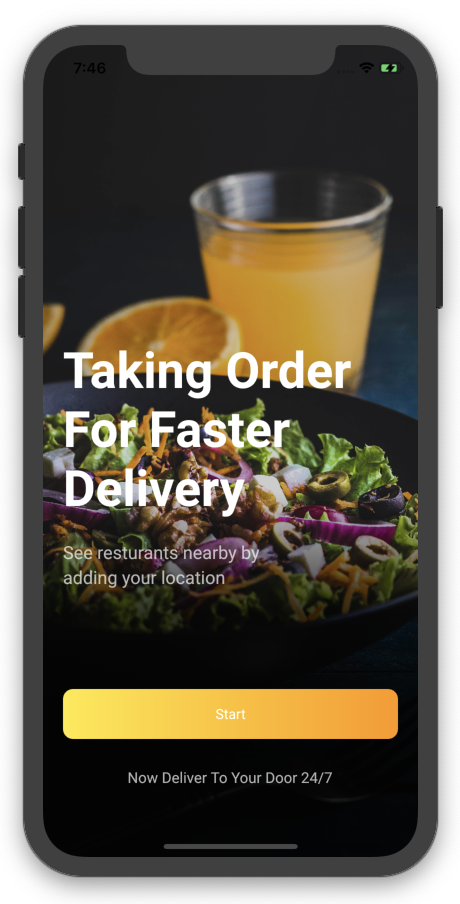
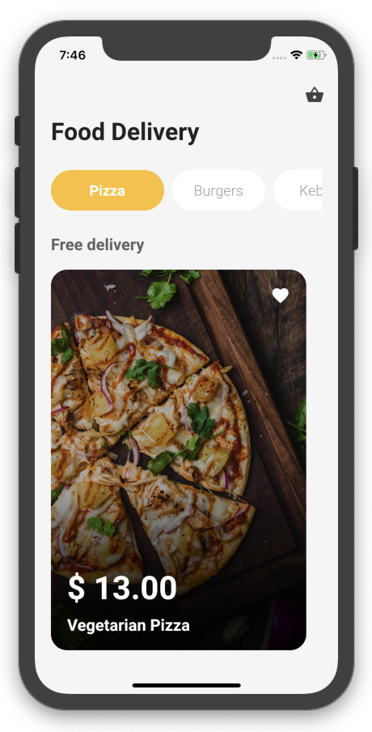
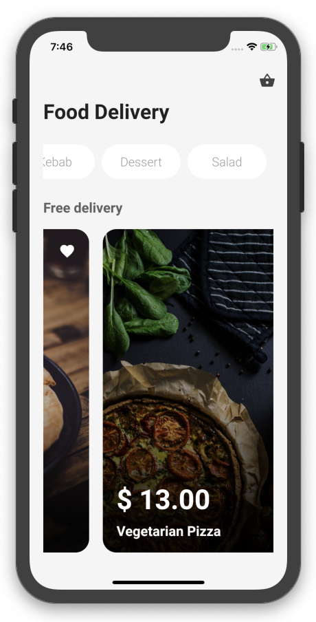

## Flutter Food Delivery Application Design - Day 3

```dart
class Day3 extends Flutter100DaysOfCode {
  video() {
    return {
      "title": "Flutter Food Delivery Application Design",
      "description": "Let's see how we can design a Food Delivery app UI and add some animation.",
      "day": 3,
      "videoLink": "https://youtu.be/lff21mmYhvQ"
    }
  }
}
```

[Watch it on Youtube](https://youtu.be/lff21mmYhvQ)
<br>

## Previous Designs
[Checkout my Youtube channel](https://youtube.com/afgprogrammer)
<br>

## Development Setup
Clone the repository and run the following commands:
```
flutter pub get
flutter run
```


## ScreenShot




## Links

* [Website](https://afgprogrammer.com)
* [Youtube channel](https://youtube.com/afgprogrammer)
* [Twitter](https://twitter.com/afgprogrammer)
* [Instagram](https://instagram.com/afgprogrammer)
